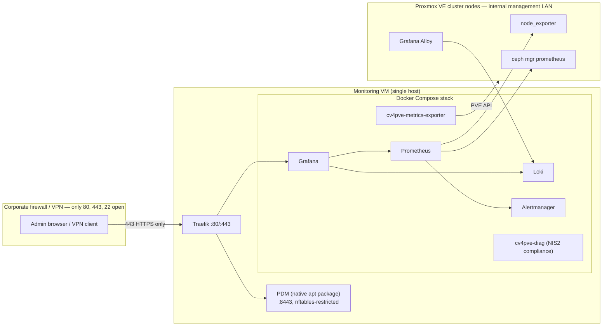

# Proxmox Biome — Observability, Audit & NIS2 Compliance Stack

A single external monitoring/audit VM for a growing Proxmox VE + Ceph
cluster: metrics, logs, alerting, and NIS2-tagged compliance reporting,
behind a hardened Traefik reverse proxy, with local-auth bootstrap and a
supported path to Keycloak SSO.

## Why

Monitoring a Proxmox/Ceph cluster that's growing (in the case this repo
was built for, 7 → 11 nodes) means aggregating health, metrics, logs, and
compliance evidence from *outside* the cluster — so the monitoring stack
keeps working even if the cluster itself is degraded. This repo is that
external stack: production-grade, tested, and documented, not a one-off
script collection.

## Architecture



See [docs/architecture.md](docs/architecture.md) for the full diagram,
data flow, and network segmentation, and
[docs/network-port-matrix.md](docs/network-port-matrix.md) for the
authoritative port-by-port breakdown.

## What's in the stack

| Component | Role |
| --- | --- |
| **Traefik** | Reverse proxy — the *only* thing exposed past the corporate perimeter (443). |
| **Prometheus + Alertmanager** | Metrics collection and alerting for PVE nodes and Ceph. |
| **Grafana** | Dashboards (Node Exporter Full, Ceph Cluster, provisioned automatically). |
| **Loki + Grafana Alloy** | Log aggregation, including `auditd` traceability logs from each node. |
| **cv4pve-metrics-exporter** | PVE-object-level metrics (VM/LXC/storage state) that node_exporter/Ceph's own exporter don't cover. |
| **cv4pve-diag** | Default NIS2/ISO27001/GDPR/DORA-tagged compliance auditor, scheduled daily. |
| **Proxmox Datacenter Manager (PDM)** | Native install, reverse-proxied — see [ADR-0003](docs/adr/0003-pdm-colocated-native-loopback-proxy.md). |
| **PegaProx** | Optional, opt-in, EXPERIMENTAL — see [ADR-0005](docs/adr/0005-cv4pve-diag-default-pegaprox-experimental.md). |
| **oauth2-proxy** | Keycloak OIDC ForwardAuth for services with no native SSO support (Phase 2 — [ADR-0006](docs/adr/0006-local-auth-bootstrap-then-keycloak-oidc.md)). |

Every design decision above — and the alternatives considered and
rejected — is recorded in [docs/adr/](docs/adr/).

## Quick start

```bash
git clone https://github.com/gsamuele78/Proxmox_biome_log_collector.git
cd Proxmox_biome_log_collector
cp .env.example .env
"${EDITOR:-vi}" .env
scripts/generate-secrets.sh
scripts/bootstrap-monitoring-vm.sh
```

This is the abbreviated version — the full walkthrough (VM sizing, Docker
Engine install, native PDM install + its required host firewall step,
per-node agent setup, TLS certificate options) is
[docs/deployment-guide.md](docs/deployment-guide.md).

## Documentation

- [docs/architecture.md](docs/architecture.md) — diagram, data flow, network segmentation.
- [docs/network-port-matrix.md](docs/network-port-matrix.md) — authoritative port table.
- [docs/deployment-guide.md](docs/deployment-guide.md) — step-by-step deployment.
- [docs/hardening.md](docs/hardening.md) — container hardening baseline + NIS2 Art. 21 control mapping.
- [docs/keycloak-integration.md](docs/keycloak-integration.md) — Phase 2 SSO wiring.
- [docs/troubleshooting.md](docs/troubleshooting.md) — symptom → cause → fix.
- [docs/runbook-incident-response.md](docs/runbook-incident-response.md) — alert → triage → NIS2 notification timeline.
- [docs/roadmap.md](docs/roadmap.md) — deliberately deferred work, and why.
- [docs/adr/](docs/adr/) — every architectural decision, with alternatives considered.
- [docs/plan/EXECUTION-PLAN.md](docs/plan/EXECUTION-PLAN.md) — the build plan this repo was built from, checked off.
- [docs/research/original-chat-transcript.md](docs/research/original-chat-transcript.md) — the original research that motivated this repo (provenance only, unedited).

## Testing & CI

```bash
# Everything CI runs, documented for local use:
cat tests/README.md
```

Lint (yamllint, hadolint, shellcheck, markdownlint), config validation
(`docker compose config`, `promtool`, `amtool`), security scanning
(gitleaks, Trivy), and an integration smoke test all run in
[.github/workflows/](.github/workflows/) on every push and PR.

## Contributing

See [CONTRIBUTING.md](CONTRIBUTING.md). Security issues:
[SECURITY.md](SECURITY.md).

## License

[MIT](LICENSE).
