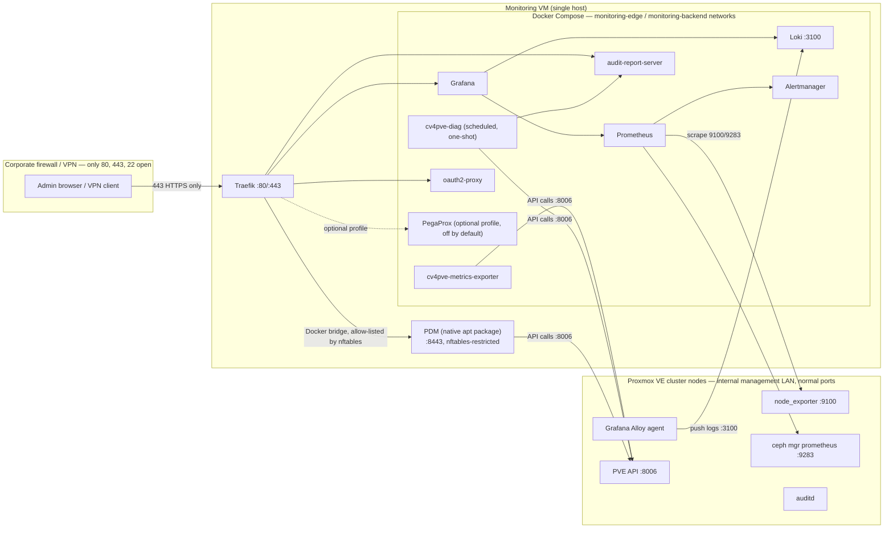

# Architecture

## Overview

A single **monitoring VM**, external to the Proxmox VE + Ceph cluster it
observes, aggregates metrics, logs, and NIS2 compliance reports for the
cluster. It runs two things side by side:

- A **Docker Compose stack** (Traefik, Prometheus, Grafana, Loki,
  Alertmanager, cv4pve-metrics-exporter, cv4pve-diag, audit-report-server,
  oauth2-proxy, docker-socket-proxy, and optionally PegaProx).
- **Proxmox Datacenter Manager (PDM)**, installed **natively** via apt —
  not containerized — listening on `:8443` and isolated from the
  management LAN by a host nftables rule (PDM has no configurable listen
  address of its own; see ADR-0003).

See ADR-0001 for why the VM is external to the cluster, and ADR-0003 for
why PDM is native-and-firewalled rather than containerized or on its own
VM.

## Network segmentation

Two Docker networks separate services that must be reachable through
Traefik from services that must never be reachable except by another
container:

- **`monitoring-edge`** — Traefik, docker-socket-proxy, oauth2-proxy, and
  every service Traefik routes to directly (Grafana, audit-report-server,
  and Traefik's own API). This is the only network with a path to the host
  network via Traefik's published ports.
- **`monitoring-backend`** — Prometheus, Alertmanager, Loki,
  cv4pve-metrics-exporter, cv4pve-diag. Services here that need to be
  user-visible (Prometheus, Alertmanager) are dual-homed onto
  `monitoring-edge` as well so Traefik can route to them; nothing on
  `monitoring-backend` alone is ever reachable from outside the Docker
  host.

See `docs/network-port-matrix.md` for the full port-by-port breakdown, and
`docker-compose.yml` for the actual network assignments.

## Data flow

1. **Metrics**: `node_exporter` (installed per-node via
   `scripts/node-setup/install-node-exporter.sh`) and Ceph's built-in
   `mgr prometheus` module (enabled via
   `scripts/node-setup/enable-ceph-prometheus.sh`) expose Prometheus
   endpoints on each node/mgr host. Prometheus, running in Docker on the
   monitoring VM, scrapes them directly over the management LAN using
   file-based service discovery (`config/prometheus/targets/*.json`,
   generated from `.env`, not hand-maintained YAML with baked-in IPs).
   `cv4pve-metrics-exporter` adds PVE-object-level metrics (VM/LXC/storage
   state) that `node_exporter` and Ceph's exporter don't cover.
2. **Logs**: Grafana Alloy, installed per-node
   (`scripts/node-setup/install-alloy-agent.sh`), tails relevant system
   logs (including `auditd` output) and pushes them to Loki's ingest API
   on the monitoring VM. See ADR-0004 for why Alloy replaces Promtail.
3. **Compliance**: `cv4pve-diag` runs on a systemd timer
   (`scripts/systemd/cv4pve-diag.timer`, daily at 02:15 local + jitter),
   producing NIS2/ISO27001/GDPR/DORA-tagged HTML reports served by
   `audit-report-server` (nginx) behind Traefik. See ADR-0005 for why it's
   the default auditor and PegaProx stays optional.
4. **Visualization & alerting**: Grafana queries Prometheus and Loki
   directly (Docker-internal network, never through Traefik). Prometheus
   evaluates alert rules (`config/prometheus/rules/*.yml`) and fires
   through Alertmanager, which routes to email/webhook per
   `config/alertmanager/alertmanager.yml.tmpl`.
5. **Access**: Every exposed hostname is reachable only via Traefik on
   443, host-routed. Bootstrap auth is Traefik `basicAuth`
   (`config/traefik/dynamic/middlewares.yml`); steady-state auth is
   Keycloak OIDC, either native (Grafana, PVE/PDM) or via oauth2-proxy
   ForwardAuth for services with no native OIDC support. See ADR-0006 and
   `docs/keycloak-integration.md`.

## Why a single hybrid VM, not two

Splitting Docker Compose and PDM onto separate VMs would mean PDM needs
its own perimeter firewall rule (or a second reverse-proxy hop across the
management LAN back to Traefik) for no operational benefit — it would just
relocate the nftables trust boundary to a different host, not remove it,
and it would cost the VM sprawl of managing a second host for a workload
that comfortably shares resources with the Compose stack. See ADR-0003's
alternatives section for the full reasoning, including why containerizing
PDM itself (nested KVM/LXC) was rejected.
